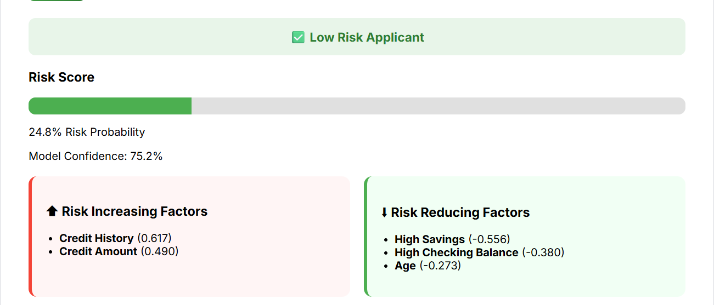
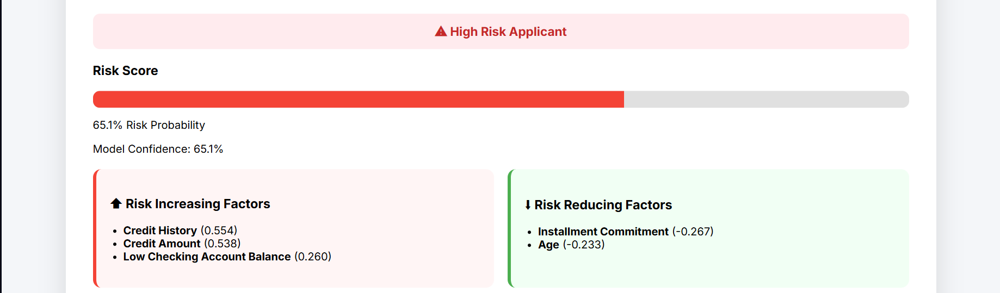
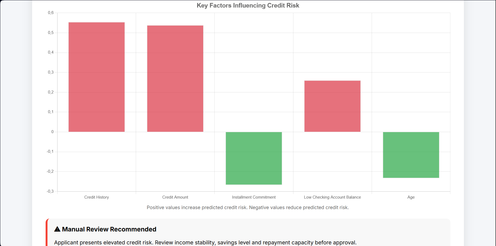

# Credit Risk ML Pipeline

A machine learning application that predicts the credit risk of loan applicants and provides explainable AI insights using SHAP values.

## Live Demo

https://credit-risk-ml-pipeline.onrender.com

---

## Project Overview

This project predicts whether a loan applicant is likely to represent a **high credit risk** or **low credit risk** based on financial and demographic information.

The application combines:

- Machine Learning
- Explainable AI (SHAP)
- FastAPI backend
- Interactive Web Dashboard
- Cloud Deployment

The goal is to simulate a real-world credit assessment system used in banking and financial institutions.

---

## Features

### Credit Risk Prediction

Predicts:

- High Risk Applicant
- Low Risk Applicant

using a trained Random Forest model.

### Risk Probability

Displays the probability of default as a risk score.

Example:

```
Risk Probability: 65.1%
```

### Explainable AI

Uses SHAP values to explain:

- Which factors increase risk
- Which factors reduce risk

### Interactive Dashboard

Includes:

- Risk score bar
- Confidence score
- SHAP impact chart
- Risk increasing factors
- Risk reducing factors
- Automated recommendation engine

### Business Recommendations

Provides actionable recommendations such as:

```
Manual Review Recommended
```

or

```
Applicant appears suitable for standard approval procedures
```

---

## Dataset

This project uses the German Credit Dataset.

Features include:

- Checking account status
- Credit history
- Loan duration
- Credit amount
- Savings
- Employment status
- Age
- Existing credits

Target:

- Good Credit Risk
- Bad Credit Risk

---

## Machine Learning Pipeline

### Data Preprocessing

- Missing value handling
- Categorical encoding
- Numerical scaling

### Model

Random Forest Classifier

### Evaluation Metrics

| Metric | Score |
|----------|----------|
| Accuracy | 74.5% |
| ROC-AUC | 78.1% |

---

## Explainability

The project uses SHAP (SHapley Additive exPlanations) to interpret model predictions.

Example output:

| Feature | Impact |
|----------|----------|
| Credit History | ↑ Increase Risk |
| Credit Amount | ↑ Increase Risk |
| Age | ↓ Reduce Risk |

---

## Tech Stack

### Backend

- Python
- FastAPI
- Scikit-Learn
- SHAP
- Pandas
- NumPy

### Frontend

- HTML
- CSS
- JavaScript
- Chart.js

### Deployment

- Render

---

## Project Structure

```text

credit-risk-ml-pipeline/
│
├── data/
│   ├── raw/
│   │   └── credit_data.csv
│   └── credit.db
│
├── notebooks/
│
├── screenshots/
│
├── templates/
│   └── index.html
├── src/
│   ├── data_loader.py
│   ├── queries.py
│   ├── train.py
│   └── model.pkl
│
├── index.html
├── main.py
├── README.md
├── LICENSE
├── Procfile
└── .python-version
```

---

## Application Screenshots

### Low Risk Prediction



### High Risk Prediction



### Explainable AI Dashboard



---

## Future Improvements

- PDF report generation
- XGBoost model comparison
- Model monitoring
- User authentication
- Database integration
- Docker deployment

---

## Author

Beatriz Ferreira

PhD Candidate in Condensed Matter Physics

Interested in:

- Machine Learning
- Data Science
- Explainable AI
- Predictive Modeling